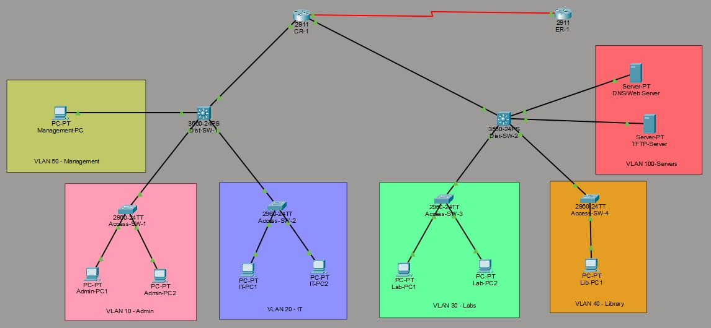

# Router & Switch Management with TFTP Backup & IOS Upgrade

## Overview

This project simulates an enterprise university campus network in Cisco Packet Tracer 9.0. It features a 3-tier hierarchical topology with centralized TFTP-based configuration backup, IOS image management, OSPF dynamic routing, inter-VLAN routing, and network security.

---

## Network Topology



---

## Table of Contents

- Network Design
- VLAN & IP Scheme
- Key Features
- TFTP Backup & IOS Upgrade
- Security
- Verification
- Files in this Repository

---

## Network Design

The topology follows a 3-tier hierarchical model:

```text
             [ Edge Router ER-1 ] ← Internet/ISP
                      |
             [ Core Router CR-1 ]
             /                   \
      [ Dist-SW-1 ]          [ Dist-SW-2 ]
    (Admin, IT, Mgmt)     (Labs, Library, Servers)
      /         \              /           \
 [Access-SW-1] [Access-SW-2] [Access-SW-3] [Access-SW-4]
  Admin Dept    IT Dept       Computer Lab   Library
```

| Device | Model | Role |
|---|---|---|
| CR-1 | Cisco 2911 | Core router, OSPF backbone |
| ER-1 | Cisco 2911 | WAN edge, NAT, DHCP |
| Dist-SW-1/2 | Cisco 3560-24PS | L3 switches, inter-VLAN routing |
| Access-SW-1 to 4 | Cisco 2960-24TT | End-user access switches |
| TFTP Server | Server-PT | Config & IOS backup |
| DNS/Web Server | Server-PT | Internal services |

---

## VLAN & IP Scheme

| VLAN | Name | Subnet | Gateway |
|---|---|---|---|
| 10 | Admin | 192.168.10.0/24 | 192.168.10.1 |
| 20 | IT | 192.168.20.0/24 | 192.168.20.1 |
| 30 | Labs | 192.168.30.0/24 | 192.168.30.1 |
| 40 | Library | 192.168.40.0/24 | 192.168.40.1 |
| 50 | Management | 192.168.50.0/24 | 192.168.50.1 |
| 100 | Servers | 192.168.100.0/24 | 192.168.100.1 |

Key IPs:
- TFTP Server → `192.168.100.10`
- DNS/Web Server → `192.168.100.20`
- Management PC → `192.168.50.10`

---

## Key Features

- Multi-Area OSPF
- Inter-VLAN Routing
- 802.1Q Trunking
- NAT/PAT Configuration
- DHCP Configuration
- STP PVST+ Implementation
- TFTP Backup & Restore
- IOS Upgrade Simulation
- SSH Remote Access
- ACL & Port Security

---

## TFTP Backup & IOS Upgrade

### Configuration Backup

```bash
Router# copy running-config tftp
Address or name of remote host? 192.168.100.10
Destination filename? CR-1-running-backup
```

### Configuration Restore

```bash
Router# copy tftp running-config
Address or name of remote host? 192.168.100.10
Source filename? CR-1-running-backup
```

### IOS Upgrade Process

```bash
CR-1# copy flash: tftp:
CR-1# copy tftp flash:
CR-1(config)# boot system flash:new-ios.bin
CR-1# reload
```

---

## Security

| Feature | Implementation |
|---|---|
| SSH v2 | Secure remote device management |
| ACLs | Restrict TFTP access |
| Port Security | Sticky MAC & violation protection |
| STP BPDU Guard | Enabled on access ports |
| Password Encryption | Service password-encryption |

---

## Verification

```bash
show ip ospf neighbor
show ip route ospf
show vlan brief
show interfaces trunk
show flash:
show startup-config
show access-lists
show ip ssh
```

Ping tests successfully verified:
- Inter-VLAN connectivity
- TFTP server reachability
- WAN connectivity
- OSPF routing functionality

---

## Files in this Repository

```text
Router-Switch-Management-with-TFTP/
│
├── README.md
├── Final NND Project.pkt
├── NND Project Report.pdf
├── LICENSE
│
└── Images/
    └── project.png
```

---

## Requirements

- Cisco Packet Tracer 9.0 or higher
- Basic networking knowledge
- Routing & Switching concepts

---

## Contributors

- Khushi Kumari
- Vansh Bhardwaj
- Ishita Soni

---

## License

This project is licensed under the MIT License.